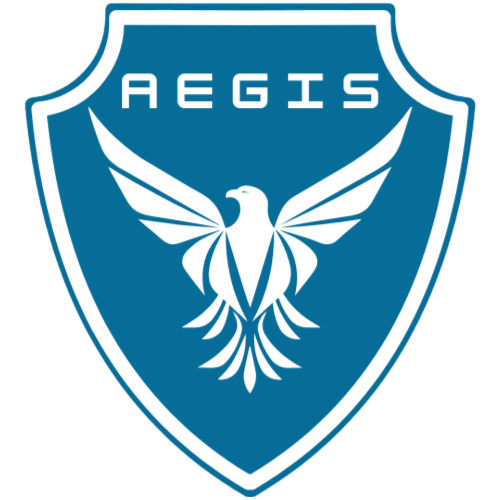
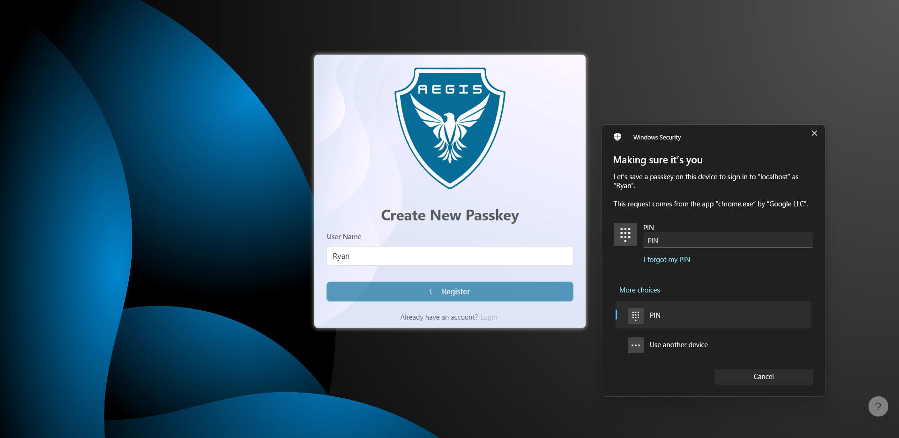
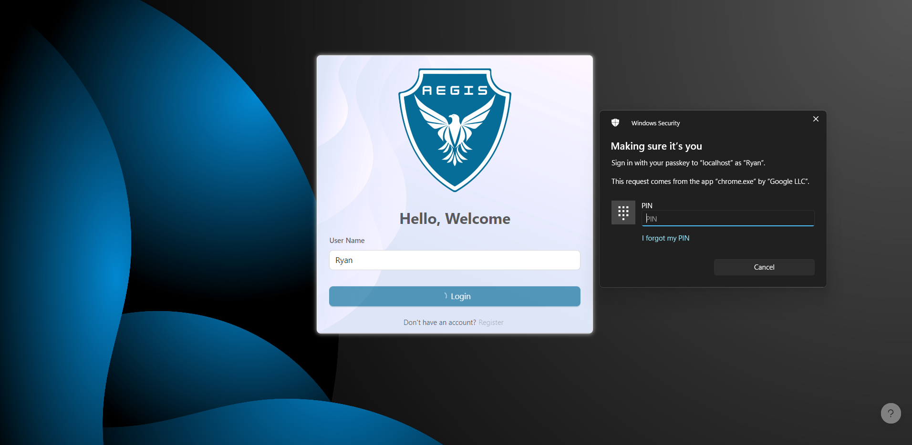
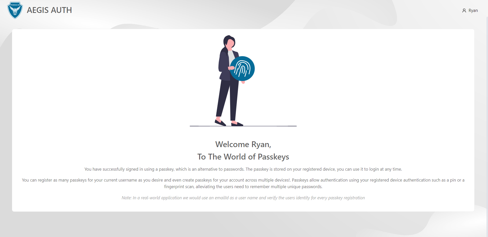
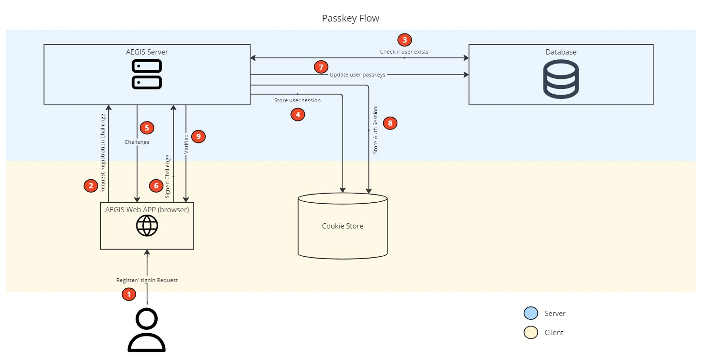

<h1 align="center">
     
    AEGIS - Passkey Authentication Flow
</h1>

AEGIS is an authentication module for seamless password-free authentication flow using passkeys. 

#### Features
- <b>Password-Free Logins:</b> AEGIS eliminates the need for traditional passwords, simplifying the login process.
- <b>Familiar and Convenient:</b> Users can register and sign in using their device authenticators, such as PINs, biometric scanners and hardware authentication keys.
- <b>Seamless Cross-Device Access:</b> Once registered, users can effortlessly authenticate and access their accounts from any device using their passkey.
- <b>Enhanced Security:</b> AEGIS leverages the security of the user's operating system and passkey technology for greater protection.
- <b>Easy Expansion:</b> AEGIS allows users to create additional passkeys for added flexibility and security.

AEGIS was built in Next JS for it's easy to use server actions. The user information and passkey public keys are stored in MongoDB, while the private key is stored and maintained by the users operating system. This eliminates the need for a traditional password  and relives the user from having to remember all the unique passwords that they have set across applications.

The registration and verification between AEGIS and the users system is done by using the [Web Authentication API](https://developer.mozilla.org/en-US/docs/Web/API/Web_Authentication_API)

AEGIS allows a user to register and sign-in using their exiting authenticator such as their device pin, biometric scanner or even using a physical key such as a [YubiKey](https://www.yubico.com/products/). The flow is similar to how a user would unlock their laptop or mobile device. 

Once registered the user can use their device for authentication to login into the application from their any other device. The module further allows users to create additional passkeys.

## Preview

    
    

        Registering a new Passkey
    

       
    
    

        Logging in using registered passkey
    

       
    
    

        Logged in successfully
    

## What is a Passkey?
A passkey is like a digital key stored on your device that lets you log in to websites and apps without needing a password. It's more secure than a traditional password because it's protected by your device's security features. Think of it as a way to unlock your online accounts using a secure key that's always with you.

## Working

    
    

        Passkey Authentication and verification flow
    

### Passkey Registration
1. The user requests a registration using a username.
1. A call is made to the AEGIS Server to get the registration challenge and public key.
1. The server fetches the user from the database using the username property, if a user does not exist, a user is created and stored in the cookie store.
1. The user details are stored in a cookie store, this data is required for the verification process. We can also use Redis cache to store this data. The cookie will always be encrypted and can only be decrypted by the server.
1. A challenge is generated by the server and is sent to the browser.
1. The browser solves the challenge and sends it back to the server for verification.
1. The signed challenge is verified by the server, if the challenge is valid, a new passkey is created for the user.
1. The server deletes the registration session, there is no auth session created at the time of registration so this step is skipped.
1. The server returns a 200 OK status to the browser, the browser can use this information to redirect to a login page

### Passkey Login
1. The user requests a sign-in using a username.
1. A call is made to the AEGIS Server to get the registration challenge and public key.
1. The server fetches the user from the database using the username property, if the user does not exist, an error is thrown.
1. The user details are stored in a cookie store, this data is required for the verification process.
1. A challenge is generated by the server and is sent to the browser.
1. The browser solves the challenge and sends it back to the server for verification.
1. The signed challenge is verified by the server, if the challenge is valid, the counter is updated by 1.
1. The server deletes the registration session, and creates an auth session cookie. The browser will use this cookie to determine if the user is authenticated or not. The cookie will always be encrypted and can only be decrypted by the server.
1. The server returns a 200 OK status to the browser, the browser can use this information to redirect to a home page.

The challenge is a random string sent by the server. The user's device uses its existing private key to create a digital signature of the challenge. This signature proves that the device owns the private key.

The signed challenge is then sent back to the server. The server uses the public key to verify that the signature is valid. If the signature is valid, it means the device has the correct private key, confirming the user's identity.

## References
- Research and Documentation
    - Passwordless login with passkeys - https://developers.google.com/identity/passkeys
    - FIDO Passkeys - https://fidoalliance.org/how-fido-works
    - Web Authentication API - https://developer.mozilla.org/en-US/docs/Web/API/Web_Authentication_API
    - What are passkeys - https://clerk.com/blog/what-are-passkeys?utm_source=theo&utm_medium=youtube&utm_campaign=passkeys

- Tools and Resources
    - Illustrations: https://undraw.co